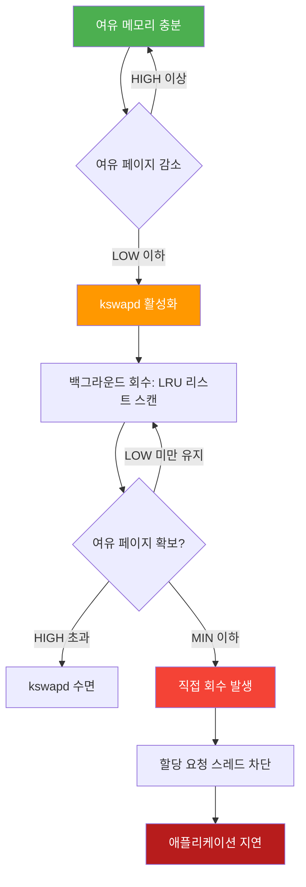
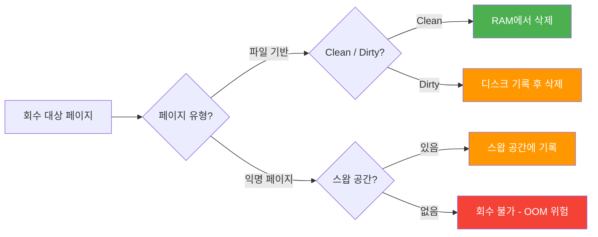
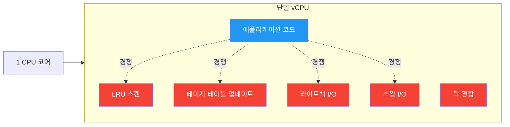

# 배경지식: 리눅스 메모리 관리와 페이지 회수

이 실험은 Azure App Service (B1 Linux, 1 vCPU, 1.75 GB RAM) 환경에서 리눅스 커널의 페이지 회수(page reclaim) 활동이 애플리케이션 부하와 무관하게 CPU 사용량 증가를 유발하는지 조사합니다. B1 Linux 계층과 같이 자원이 제한된 환경에서는 메모리가 부족할 때 이를 관리하는 커널의 오버헤드가 애플리케이션 성능에 상당한 영향을 미칠 수 있습니다.

커널 메모리 관리를 이해하는 것은 원인 불명의 CPU 급증 현상을 진단하는 데 매우 중요합니다. 흔히 발생하는 '높은 CPU 사용량' 경고는 실제 애플리케이션 코드의 비효율성 때문이 아니라, 가용 메모리 페이지를 확보하기 위해 고군분투하는 커널의 동작으로 인한 증상일 때가 많습니다. 이 문서는 커널이 메모리를 회수하기 위해 사용하는 메커니즘과 그 과정에서 발생하는 CPU 소비 원인을 다룹니다.

물리 메모리가 부족해지면 리눅스 커널은 어떤 페이지를 RAM에 유지하고 어떤 페이지를 방출할지 결정해야 합니다. '페이지 회수'라고 불리는 이 과정은 메모리 압박의 심각도에 따라 여러 단계로 진행됩니다.

## 메모리 워터마크 (min, low, high)

리눅스 커널은 가용 페이지 목록을 관리하기 위해 각 메모리 존(zone)별로 세 가지 워터마크 수준을 유지합니다. 이 임계값들은 커널이 언제 메모리 회수를 시작하고 중단할지를 결정합니다.

*   **min**: 비상 예비 영역입니다. 커널만이 이 수준 아래에서 메모리를 할당할 수 있습니다. 가용 메모리가 이 지점에 도달하면 시스템은 매우 심각한 상태에 빠진 것으로 간주됩니다.
*   **low**: kswapd(백그라운드 회수 데몬)가 깨어나서 페이지 회수를 시작하는 임계값입니다.
*   **high**: 목표 수준입니다. 가용 메모리가 이 수준 위로 올라가면 kswapd는 충분한 여유 페이지를 확보했다고 판단하고 다시 잠듦 상태로 돌아갑니다.

```
여유 페이지
    ↑
    │  ██████ high 워터마크  ── kswapd 수면 상태
    │
    │  ██████ low 워터마크   ── kswapd 활성화, 백그라운드 회수 시작
    │
    │  ██████ min 워터마크   ── 직접 회수 발생, 메모리 할당 차단 가능
    │
    0
```

다음 다이어그램은 메모리 압박이 단계적으로 어떻게 진행되는지를 보여줍니다.



이 워터마크들은 `mm/page_alloc.c`에 정의된 `watermark_boost_factor`, `watermark_scale_factor`, `min_free_kbytes`와 같은 커널 변수의 영향을 받습니다.

참조: [mm/page_alloc.c](https://github.com/torvalds/linux/blob/v6.0/mm/page_alloc.c)

## kswapd — 백그라운드 페이지 회수 데몬

kswapd는 NUMA 노드별로 존재하는 커널 스레드로, 애플리케이션 스레드를 차단하지 않고 가용 페이지 풀을 유지하는 역할을 담당합니다.

여유 페이지가 **low** 워터마크 아래로 떨어지면 kswapd가 깨어납니다. kswapd는 익명 메모리(힙/스택)와 파일 기반 메모리(페이지 캐시)의 활성/비활성 페이지를 추적하는 LRU(Least Recently Used) 리스트를 스캔합니다. 그리고 여유 메모리가 **high** 워터마크를 초과할 때까지 페이지를 방출합니다.

kswapd가 CPU에 미치는 영향은 주로 이 리스트를 스캔하는 과정에서 발생합니다. 만약 페이지를 디스크의 스압 공간으로 내보내야(swap out) 한다면, kswapd는 그에 따른 I/O 대기도 관리해야 합니다. `/proc/vmstat` 파일의 `pgscan_kswapd`와 `pgsteal_kswapd` 카운터를 통해 kswapd의 활동을 모니터링할 수 있습니다.

소스: [mm/vmscan.c](https://github.com/torvalds/linux/blob/v6.0/mm/vmscan.c)

## 직접 회수 (Direct Reclaim) — 동기식, 블로킹

직접 회수는 메모리 할당 요청을 즉시 처리할 수 없고 kswapd가 수요를 따라잡지 못할 때 발생합니다. 백그라운드에서 실행되는 kswapd와 달리, 직접 회수는 동기적으로 동작합니다.

여유 메모리가 **min** 워터마크 아래로 떨어지면, 메모리를 요청한 프로세스가 직접 회수 작업을 수행하도록 강제됩니다. 이 과정에서 **메모리 할당을 요청한 스레드가 차단(block)**되므로, 커널이 가용 페이지를 찾거나 생성하는 동안 애플리케이션이 멈추는 현상이 발생합니다.

`/proc/vmstat`에서는 이를 `pgscan_direct`와 `pgsteal_direct`로 추적합니다. 특히 `allocstall` 카운터는 프로세스가 직접 회수로 인해 지연될 때마다 증가하므로 매우 중요한 지표입니다.

## 스왑 메커니즘

스왑(Swap)은 커널이 RAM에서 방출하는 익명 페이지(malloc 등으로 할당된 애플리케이션 힙 데이터)를 저장하기 위한 디스크 기반 공간입니다.

다음 다이어그램은 페이지 유형에 따라 회수 방식이 어떻게 다른지 보여줍니다.



*   **파일 기반 페이지**: mmap된 파일이나 페이지 캐시를 포함합니다. 수정되지 않은(clean) 페이지는 단순히 RAM에서 삭제하여 회수할 수 있습니다. 수정된(dirty) 페이지는 방출하기 전에 디스크에 다시 기록해야 합니다.
*   **익명 페이지**: 디스크에 대응하는 파일이 없는 페이지입니다. 이 페이지들이 차지하는 RAM 공간을 확보하려면 커널은 반드시 이를 스왑 공간에 기록해야 합니다.

스왑 I/O 비용은 매우 높습니다. I/O 경로를 관리하는 데 CPU가 소비되며, 디스크 작업의 지연 시간으로 인해 애플리케이션에 심각한 지연이 발생할 수 있습니다. Azure App Service B1 환경에서는 일반적으로 약 512 MB의 스왑 공간이 임시 스토리지에 제공되지만 성능은 제한적입니다.

`/proc/vmstat`의 주요 카운터로는 `pswpin`(디스크에서 읽어온 페이지)과 `pswpout`(디스크로 쓴 페이지)이 있습니다.

소스: [mm/vmstat.c](https://github.com/torvalds/linux/blob/v6.0/mm/vmstat.c)

## PSI — 리소스 압력 정보 (Pressure Stall Information)

PSI는 커널 4.20 버전에서 도입된 기능으로, 리소스 압력을 정량화하는 표준적인 방법을 제공합니다. 태스크가 메모리, CPU 또는 I/O를 기다리는 데 소비한 시간을 측정합니다.

`/proc/pressure/memory` 파일은 다음 세 가지 지표를 제공합니다.

*   **some**: 최소 하나 이상의 태스크가 메모리 부족으로 인해 지연된 시간의 비율입니다.
*   **full**: 유휴 상태가 아닌 모든 태스크가 동시에 메모리 대기로 인해 지연된 시간의 비율입니다.
*   **avg10, avg60, avg300**: 각각 최근 10초, 60초, 300초 동안의 이동 평균값입니다.
*   **total**: 마이크로초 단위의 누적 지연 시간입니다.

PSI는 메모리 압력이 워크로드 처리량에 실제로 얼마나 영향을 주는지 측정할 수 있는 가장 직접적인 지표입니다. 이를 통해 커널이 백그라운드 작업을 수행 중인지, 아니면 애플리케이션이 메모리 부족으로 인해 실제로 방해를 받고 있는지 구분할 수 있습니다.

참조: [Red Hat PSI 문서](https://developers.redhat.com/articles/2026/03/18/prepare-enable-linux-pressure-stall-information-red-hat-openshift)

## 페이지 회수가 CPU를 소비하는 이유

페이지 회수는 공짜가 아닙니다. 회수 과정은 다음과 같은 여러 메커니즘을 통해 CPU를 소비합니다.

1.  **LRU 스캔**: 방출할 후보 페이지를 찾기 위해 커널은 긴 페이지 리스트를 탐색해야 합니다.
2.  **페이지 테이블 업데이트**: 페이지를 방출할 때 커널은 프로세스의 페이지 테이블에서 해당 매핑을 해제해야 합니다. SMP 시스템에서는 이 과정에서 TLB shootdown이 필요할 수 있습니다.
3.  **라이트백 (Writeback)**: 수정된(dirty) 페이지를 방출하기 전 디스크에 기록하는 작업은 I/O 관리 소프트웨어 스택을 통과하며 CPU를 사용합니다.
4.  **스왑 I/O 관리**: 익명 페이지를 스왑 장치로 전송하고 다시 가져오는 과정을 조율합니다.
5.  **락 경합**: 스캔과 방출 과정에서 커널은 존(zone) 및 LRU 락을 획득해야 합니다. 여러 스레드가 동시에 메모리를 요청하면 이러한 락을 얻기 위해 서로 경쟁하게 됩니다.

다음 다이어그램은 단일 vCPU 환경에서 다양한 커널 작업이 애플리케이션과 어떻게 CPU를 경쟁하는지 보여줍니다.



B1 계층과 같은 단일 vCPU 시스템에서는 이러한 모든 커널 작업이 애플리케이션과 동일한 CPU 코어를 놓고 직접 경쟁합니다. 이 때문에 메모리 압박으로 인한 성능 저하가 멀티코어 시스템보다 훨씬 더 두드러지게 나타납니다.

## 이 실험에서 사용한 주요 /proc 파일

이 파일들은 메모리 압박과 CPU 사용량 사이의 상관관계를 분석하기 위한 기초 데이터를 제공합니다.

### /proc/meminfo

| 필드 | 설명 |
|------|------|
| MemTotal | 사용 가능한 총 RAM |
| MemFree | 완전히 여유 있는 페이지 |
| MemAvailable | 스와핑 없이 새로운 할당에 사용 가능한 예상 메모리 |
| Cached | 페이지 캐시 크기 |
| SwapTotal | 총 스왑 공간 |
| SwapFree | 미사용 스왑 공간 |
| Dirty | 디스크에 기록 대기 중인 페이지 |
| SReclaimable | 회수 가능한 슬랩(Slab) 객체 |

### /proc/vmstat

| 카운터 | 설명 |
|--------|------|
| pswpin | 디스크에서 스왑 인된 페이지 수 |
| pswpout | 디스크로 스왑 아웃된 페이지 수 |
| pgscan_kswapd | kswapd가 스캔한 페이지 수 |
| pgscan_direct | 직접 회수로 스캔한 페이지 수 |
| pgsteal_kswapd | kswapd가 성공적으로 회수한 페이지 수 |
| pgsteal_direct | 직접 회수로 성공적으로 회수한 페이지 수 |
| allocstall | 직접 회수로 인해 프로세스가 지연된 횟수 |
| pgfault | 페이지 폴트 (마이너) |
| pgmajfault | 메이저 페이지 폴트 (디스크 I/O 발생) |

### /proc/pressure/memory

이 파일은 태스크가 지연된 시간의 비율을 보여줍니다. 예를 들어:
`some avg10=0.00 avg60=0.00 avg300=0.00 total=0`
`full avg10=0.00 avg60=0.00 avg300=0.00 total=0`

## Azure App Service 환경

B1 SKU는 1 vCPU와 1.75 GB RAM을 가진 제한된 환경입니다. 리눅스 워커는 Hyper-V 위에서 게스트 OS로 실행됩니다. 여러 Node.js 애플리케이션이 종종 동일한 App Service Plan을 공유하며, 이는 한정된 자원을 놓고 서로 경쟁함을 의미합니다.

앱 컨테이너 내에서 `/proc` 파일을 볼 때 주의할 점은, 많은 값들이 보이지만 일부 값은 호스트의 전체 물리 메모리가 아닌 컨테이너의 cgroup 제한을 반영할 수 있다는 것입니다. Azure 플랫폼 레벨의 `MemoryPercentage` 메트릭은 플랫폼 데몬과 모든 호스트 앱을 포함한 워커 전체의 프로세스를 포함합니다.

B1 Linux에서는 스왑이 사용 가능하며, 보통 임시 디스크에 약 512 MB가 할당됩니다. 이는 안전장치 역할을 하지만, 임시 스토리지의 성능 한계로 인해 과도한 스와핑은 상당한 CPU 오버헤드와 애플리케이션 지연으로 이어집니다.

## 참고 자료

*   [Linux kernel v6.0 소스 — mm/vmscan.c (페이지 회수)](https://github.com/torvalds/linux/blob/v6.0/mm/vmscan.c)
*   [Linux kernel v6.0 소스 — mm/vmstat.c (VM 카운터)](https://github.com/torvalds/linux/blob/v6.0/mm/vmstat.c)
*   [Linux kernel v6.0 소스 — mm/page_alloc.c (워터마크)](https://github.com/torvalds/linux/blob/v6.0/mm/page_alloc.c)
*   [Red Hat — Pressure Stall Information](https://developers.redhat.com/articles/2026/03/18/prepare-enable-linux-pressure-stall-information-red-hat-openshift)
