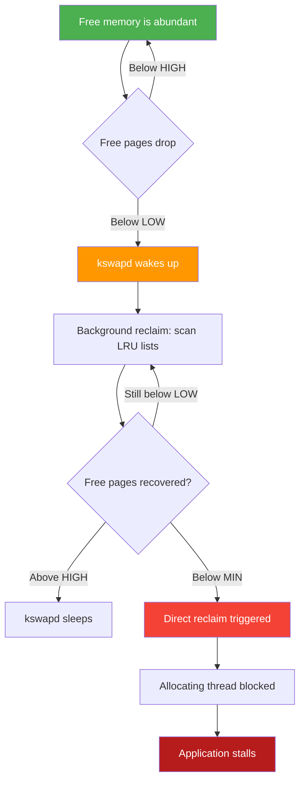
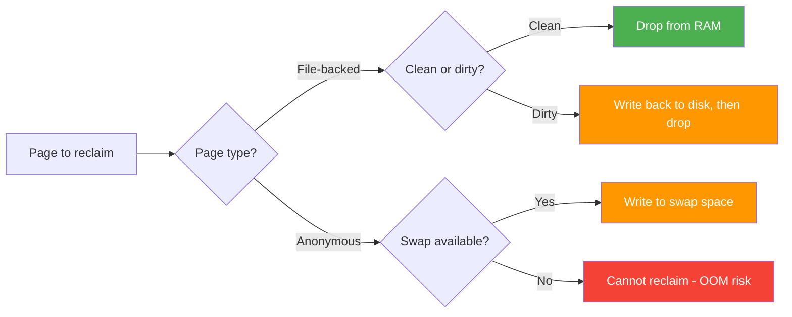
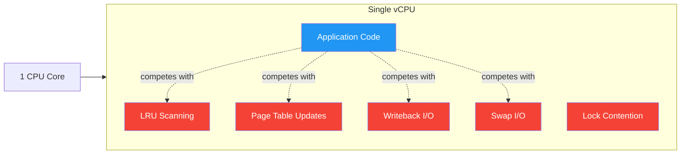

# Background: Linux Memory Management and Page Reclaim

This experiment investigates whether Linux kernel page reclaim activity causes CPU increases on Azure App Service. Specifically, we focus on the B1 Linux tier, which provides 1 vCPU and 1.75 GB of RAM. In such a resource-constrained environment, the overhead of managing memory when it runs low can significantly impact application performance.

Understanding kernel memory management is vital for diagnosing unexpected CPU spikes. Often, a "high CPU" alert is a symptom of the kernel struggling to find free memory pages rather than the application code itself being inefficient. This page covers the mechanisms the kernel uses to reclaim memory and how those operations consume CPU cycles.

When physical memory runs low, the Linux kernel must decide which pages to keep in RAM and which to evict. This process, known as page reclaim, involves several distinct stages depending on the severity of the memory pressure.

## Memory Watermarks (min, low, high)

The Linux kernel maintains three watermark levels for each memory zone to manage free page inventory. These thresholds determine when the kernel starts and stops reclaiming memory.

*   **min**: The emergency reserve. Only the kernel can allocate memory below this level. If free memory reaches this point, the system is in critical condition.
*   **low**: The threshold where the background reclaim daemon (kswapd) wakes up and begins freeing pages.
*   **high**: The target level. Once free memory rises above this, kswapd goes back to sleep, satisfied that there are enough free pages.

```
Free Pages
    ↑
    │  ██████ high watermark  ── kswapd sleeps
    │
    │  ██████ low watermark   ── kswapd wakes, background reclaim starts
    │
    │  ██████ min watermark   ── direct reclaim triggers, allocations may block
    │
    0
```

The following diagram illustrates the escalation of memory pressure and the corresponding kernel responses:



These watermarks are influenced by kernel variables such as `watermark_boost_factor`, `watermark_scale_factor`, and `min_free_kbytes`, defined in `mm/page_alloc.c`.

Reference: [mm/page_alloc.c](https://github.com/torvalds/linux/blob/v6.0/mm/page_alloc.c)

## kswapd — The Background Page Reclaim Daemon

kswapd is a per-NUMA-node kernel thread responsible for maintaining a pool of free pages without blocking application threads.

When free pages drop below the **low** watermark, kswapd wakes up. It scans Least Recently Used (LRU) lists, which track active and inactive pages for both anonymous memory (heap/stack) and file-backed memory (page cache). It evicts pages until free memory exceeds the **high** watermark.

The CPU impact of kswapd comes from the cycles spent scanning these lists. If pages must be swapped out to disk, kswapd also manages the resulting I/O wait. You can monitor its activity using counters like `pgscan_kswapd` and `pgsteal_kswapd` in `/proc/vmstat`.

Source: [mm/vmscan.c](https://github.com/torvalds/linux/blob/v6.0/mm/vmscan.c)

## Direct Reclaim — Synchronous, Blocking

Direct reclaim occurs when an allocation request cannot be satisfied immediately, and kswapd cannot keep up with the demand. Unlike kswapd, which runs in the background, direct reclaim is synchronous.

When free memory falls below the **min** watermark, the process requesting memory is forced to perform the reclaim work itself. This **blocks the allocating thread**, causing the application to stall while it waits for the kernel to find or create free pages.

In `/proc/vmstat`, this is tracked by `pgscan_direct` and `pgsteal_direct`. The `allocstall` counter is particularly important, as it increments every time a process is stalled waiting for direct reclaim.

## Swap Mechanics

Swap is disk-backed storage used for anonymous pages (such as application heap data allocated via malloc) that the kernel evicts from RAM.

The following diagram illustrates how the kernel decides to reclaim different types of pages:



*   **File-backed pages**: These include mmap'd files and the page cache. Clean pages can be evicted by simply dropping them from RAM. Dirty pages must be written back to disk before eviction.
*   **Anonymous pages**: These have no backing file on disk. To free the RAM they occupy, the kernel must write them to swap space.

The cost of swap I/O is high. Managing the I/O path consumes CPU, and the latency of disk operations can cause significant application delays. On Azure App Service B1, swap is typically available (around 512 MB) but resides on ephemeral storage, which has limited performance.

Key counters in `/proc/vmstat` include `pswpin` (pages read from swap) and `pswpout` (pages written to swap).

Source: [mm/vmstat.c](https://github.com/torvalds/linux/blob/v6.0/mm/vmstat.c)

## PSI — Pressure Stall Information

Pressure Stall Information (PSI) is a kernel feature introduced in version 4.20 that provides a canonical way to measure resource pressure. It quantifies how much time tasks spend waiting for memory, CPU, or I/O.

The file `/proc/pressure/memory` provides three metrics:

*   **some**: The percentage of time that at least one task was stalled on memory.
*   **full**: The percentage of time that all non-idle tasks were stalled on memory simultaneously.
*   **avg10, avg60, avg300**: 10, 60, and 300-second moving averages for these stalls.
*   **total**: The cumulative stall time in microseconds.

PSI is the most direct measure of how memory pressure affects workload throughput. It distinguishes between the kernel doing background work and the application being actively hindered by lack of memory.

Reference: [Red Hat PSI Documentation](https://developers.redhat.com/articles/2026/03/18/prepare-enable-linux-pressure-stall-information-red-hat-openshift)

## Why Page Reclaim Costs CPU

Page reclaim is not a "free" operation. It consumes CPU through several mechanisms:

1.  **LRU scanning**: The kernel must walk through long lists of pages to identify which ones are suitable for eviction.
2.  **Page table updates**: When a page is evicted, the kernel must unmap it from the process page tables, which may require TLB shootdowns on SMP systems.
3.  **Writeback**: Flushing dirty pages to disk before they can be freed consumes CPU for I/O management.
4.  **Swap I/O management**: Coordinating the transfer of anonymous pages to and from the swap device.
5.  **Lock contention**: During scanning and eviction, the kernel must acquire zone and LRU locks. If multiple threads are requesting memory, they may fight for these locks.

The following diagram illustrates the competition for CPU resources on a single-core system during memory reclaim:



On a single-vCPU system like the B1 tier, all these kernel operations compete directly with your application for the same CPU core. This makes the performance impact of memory pressure much more visible than it would be on a multi-core system.

## Key /proc Files Used in This Experiment

These files provide the raw data used to correlate memory pressure with CPU usage.

### /proc/meminfo

| Field | Description |
|-------|-------------|
| MemTotal | Total usable RAM |
| MemFree | Completely free pages |
| MemAvailable | Estimated memory available for new allocations without swapping |
| Cached | Page cache size |
| SwapTotal | Total swap space |
| SwapFree | Unused swap space |
| Dirty | Pages waiting to be written back to disk |
| SReclaimable | Slab objects that can be reclaimed |

### /proc/vmstat

| Counter | Description |
|---------|-------------|
| pswpin | Pages swapped in from disk |
| pswpout | Pages swapped out to disk |
| pgscan_kswapd | Pages scanned by kswapd |
| pgscan_direct | Pages scanned by direct reclaim |
| pgsteal_kswapd | Pages successfully reclaimed by kswapd |
| pgsteal_direct | Pages successfully reclaimed by direct reclaim |
| allocstall | Number of direct reclaim stalls |
| pgfault | Page faults (minor) |
| pgmajfault | Major page faults (required disk I/O) |

### /proc/pressure/memory

This file shows the percentage of time tasks were stalled. For example:
`some avg10=0.00 avg60=0.00 avg300=0.00 total=0`
`full avg10=0.00 avg60=0.00 avg300=0.00 total=0`

## Azure App Service Context

The B1 SKU is a constrained environment with 1 vCPU and 1.75 GB of RAM. The Linux worker runs as a guest OS on Hyper-V. Multiple Node.js applications often share the same App Service Plan, meaning they compete for these limited resources.

When viewing `/proc` files within an app container, it's important to know that while many values are visible, some might reflect the container's cgroup limits rather than the host's total physical memory. Azure's platform-level MemoryPercentage metric includes all processes on the worker, including platform daemons and all hosted apps.

Swap is available on B1 Linux, usually around 512 MB on ephemeral disk. While this provides a safety net, the performance of ephemeral storage means that heavy swapping will lead to significant CPU overhead and application latency.

## References

*   [Linux kernel v6.0 source — mm/vmscan.c (page reclaim)](https://github.com/torvalds/linux/blob/v6.0/mm/vmscan.c)
*   [Linux kernel v6.0 source — mm/vmstat.c (VM counters)](https://github.com/torvalds/linux/blob/v6.0/mm/vmstat.c)
*   [Linux kernel v6.0 source — mm/page_alloc.c (watermarks)](https://github.com/torvalds/linux/blob/v6.0/mm/page_alloc.c)
*   [Red Hat — Pressure Stall Information](https://developers.redhat.com/articles/2026/03/18/prepare-enable-linux-pressure-stall-information-red-hat-openshift)
