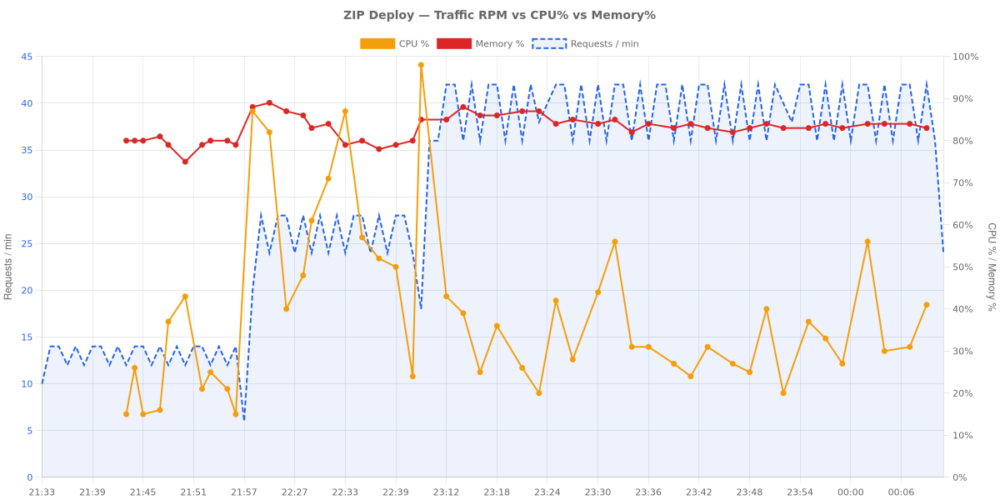
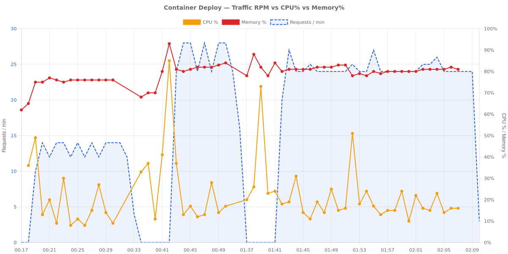

# 실험 기록: Azure App Service의 Node.js Memory Pressure

이 문서는 Azure App Service(Linux B1 SKU)에서 수행된 Memory Pressure 실험에 대한 포괄적이고 과학적인 기록을 제공합니다. 이 연구는 높은 메모리 점유율, Linux 커널의 page reclaim 활동, 그리고 예기치 않은 CPU 소비 사이의 관계를 조사합니다.

## 실험 개요

### 가설
Azure B1 Linux App Service Plan이 여러 Node.js 애플리케이션을 호스팅하여 총 메모리 점유율이 90%에 육박하면, 애플리케이션 트래픽 수준과 관계없이 Linux 커널의 page reclaim 메커니즘(kswapd, direct reclaim, swap I/O)으로 인해 CPU 사용량이 크게 증가합니다.

### 환경 세부사항
- **실험 기간**: 약 4~5시간 (배포 전환 및 복구 시간 포함)
- **Subscription ID**: *(redacted)*
- **Resource Group**: rg-node-memory-lab
- **Region**: Korea Central
- **Plan SKU**: B1 (1 vCPU, 1.75 GB RAM, Linux)
- **Runtime**: Node.js 20 LTS
- **Host MemTotal**: ~1,855 MB
- **SwapTotal**: 2,048 MB (/proc/meminfo를 통해 확인)

---

## ZIP 배포 실험

첫 번째 실험은 Node.js 애플리케이션의 표준 ZIP Deploy를 사용했습니다.

### Phase 0: 탐색
2개의 Node.js 애플리케이션(각 50MB RSS)을 배포했습니다. `/diag/proc` 엔드포인트가 `/proc/meminfo` 및 `/proc/vmstat`를 성공적으로 캡처하는지 확인했습니다. `/proc/pressure/memory`에서 PSI(Pressure Stall Information)의 존재를 확인했습니다.

### Phase 1: 기준선
- **기간**: ~25분
- **구성**: 2 apps x 50MB
- **CPU**: 15-25% (평균 20%)
- **Memory**: 79-80%
- **SwapFree**: ~1,063 MB
- **누적 pgscan_kswapd**: ~16.5M
- **누적 pgscan_direct**: 1,164
- **평균 Latency**: 56-70ms
- **데이터 포인트**: 트래픽 321행, diag 641행, azure-metrics 106행

### Phase 2a: 접근
- **기간**: ~20분
- **구성**: 4 apps x 100MB
- **CPU**: 48-87% (기준선 대비 대폭 증가)
- **Memory**: 78-89%
- **SwapFree**: 417 MB (1,063 MB에서 감소)
- **pgscan_kswapd**: 29.0M (기준선 대비 +76%)
- **pgscan_direct**: 14,609 (기준선 대비 +1155%)
- **pswpout**: 833,768 (기준선 대비 +460%)
- **Latency**: 53-70ms (CPU 급증에도 불구하고 안정적)

### Phase 2b: 핵심 테스트 (정상 상태)
- **기간**: 60분
- **구성**: 6 apps x 100MB
- **CPU Avg**: 35.2% (20-56% 범위 유지, 스케일링 중 초기 98%까지 급증)
- **Memory Avg**: 84.3% (82-88% 사이에서 안정적)
- **SwapFree**: 12-17 MB (99.2% swap 고갈)
- **pgscan_kswapd 증가**: 14.5M에서 40.4M으로 (+179%)
- **pgscan_direct 증가**: 233에서 33,372로 (+14,200%)
- **pgsteal_kswapd**: 8.1M에서 ~32M으로
- **pswpin 증가**: 121K에서 1.94M으로 (+1,500%)
- **pswpout 증가**: 321K에서 2.41M으로 (+650%)
- **allocstall**: 발생 (50 normal + 71 movable)
- **Memory Pressure (PSI)**: some avg300=5.79, full avg300=1.03
- **관찰**: 요청 속도가 앱당 1 req/10s로 일정하게 유지되었음에도 불구하고, 오로지 커널 reclaim 활동만으로 인해 CPU가 기준선 20%에서 평균 35%로 상승(1.75배 증가)했으며 주기적으로 최대 87%까지 급증했습니다.

### Phase 3: 트래픽 버스트
- **부하**: 높은 Memory Pressure 상태에서 60초 동안 10 RPS 발생.
- **결과**: 587개 요청, 오류 0건.
- **Latency**: 평균 16.8ms, p50 14ms, p95 30ms, p99 62ms.
- **CPU 영향**: 버스트 중 56-71% 도달. 시스템은 부하 상태에서도 복원력을 유지했습니다.

### 시각화 (ZIP 배포)

*그림 1: ZIP Deploy 단계별 CPU와 Memory 상관관계.*

*그림 2: pgscan_kswapd 및 pgscan_direct 카운터의 에스컬레이션.*

*그림 3: swap 고갈 시점의 격렬한 pswpin/pswpout 활동.*

*그림 4: MemAvailable, Cached, SwapFree의 세부 분석.*

*그림 5: 시간 경과에 따른 앱별 Memory 사용량(RSS).*

*그림 6: 버스트 트래픽 Latency 히스토그램.*

*그림 7: Memory Pressure 실험 — ZIP 배포. 모든 단계에서 트래픽(요청 속도)은 ~6 RPM으로 일정하게 유지된 반면, Memory 사용률은 ~80%에서 ~92%까지 상승하고 CPU는 ~15%에서 35% 이상으로 동반 상승 — CPU 증가가 트래픽이 아닌 Memory Pressure에 의한 것임을 확인.*

---

## 컨테이너 배포 실험

두 번째 실험은 Docker 컨테이너를 사용하여 동일한 시나리오를 평가했습니다.

### Phase 0-1: 기준선
- **구성**: 2 containers x 50MB
- **CPU**: 9-36% (평균 20%)
- **Memory**: 76%에서 안정화
- **SwapFree**: 1,341 MB
- **Latency**: 59-117ms (ZIP보다 눈에 띄게 높음)

### Phase 2a: 접근
- **구성**: 4 containers x 100MB
- **CPU**: 12-85% (12-28%로 안정화)
- **Memory**: 80-93% (82-84%로 안정화)
- **SwapFree**: 1,076 MB

### Phase 2b: 핵심 테스트 (실패한 시도)
각 100MB인 6개의 컨테이너를 실행하려는 시도는 플랜의 완전한 불안정화를 초래했습니다. 1-4번 앱은 503 오류를 반환했으며, 새로운 컨테이너(5-6)가 기존 컨테이너에 대해 OOM killer를 트리거했습니다. 이는 컨테이너 런타임 오버헤드가 B1 SKU에서 ZIP Deploy보다 상당히 높음을 나타냅니다.

### Phase 2b: 핵심 테스트 (조정됨)
- **기간**: 28분
- **구성**: 4 containers x 75MB
- **CPU Avg**: 18.8% (범위 10-51%)
- **Memory Avg**: 80.7%
- **SwapFree**: ~1,050 MB (49% swap 사용)
- **pgscan_kswapd 증가**: 14.2M에서 15.3M으로 (+1.1M)
- **pgscan_direct 증가**: 26,163에서 28,792로 (+2,629)
- **pswpin 증가**: 203,756에서 259,687로 (+55,931)
- **pswpout 증가**: 391,304에서 450,206으로 (+58,902)
- **Memory Pressure (PSI)**: some avg300=1.57, full avg300=0.51
- **관찰**: 컨테이너 격리로 인해 비슷한 Memory 백분율에서 ZIP 실험과 비교했을 때 더 낮은 swap 사용률(49% vs 99.2%)과 덜 격렬한 reclaim 활동이 나타났습니다.

### Phase 3: 트래픽 버스트
- **부하**: 60초 동안 10 RPS 발생.
- **결과**: 590개 요청, 오류 0건.
- **Latency**: 평균 173.9ms, p50 159ms, p95 185ms, p99 715ms.
- **관찰**: 압박 상태에서의 컨테이너 Latency는 ZIP Deploy보다 10배 높았습니다.

### 시각화 (컨테이너 배포)

*그림 8: 컨테이너화된 애플리케이션의 CPU 및 Memory 추세.*

*그림 9: 컨테이너 환경에서의 reclaim 활동.*

*그림 10: 컨테이너 실험 중의 swap 활동.*

*그림 11: 컨테이너 트래픽 버스트 중 관찰된 높은 Latency 분산.*

*그림 12: Memory Pressure 실험 — 컨테이너 배포. 트래픽(요청 속도)은 ~12 RPM으로 일관되게 낮은 수준을 유지한 반면, Memory는 ~80%에서 안정적이었고 CPU는 Pressure 단계에서 10-51% 사이로 변동. 참고: 메트릭 수집 간격이 ZIP 배포보다 sparse (~2분 간격).*

---

## 기준선 메모리가 이미 높은 이유

결과를 해석하기 전에, 앱 2개가 각각 50MB만 할당했는데도 메모리 사용률이 79-80%에서 시작하는 이유를 이해하는 것이 중요합니다.

B1 SKU는 `/proc/meminfo`의 MemTotal 기준 약 1,855 MB의 물리 RAM을 제공합니다. 그러나 사용자 애플리케이션이 시작되기 전에 이미 상당 부분이 소비됩니다:

- **플랫폼 / 호스트 런타임 오버헤드**: App Service Linux 샌드박스, Kudu(SCM) 사이드카, 컨테이너 런타임 프로세스들이 기본적으로 메모리를 소비합니다.
- **언어 런타임 풋프린트**: 각 Node.js 20 프로세스는 V8 힙 초기화, libuv, 로드된 모듈로 인해 사용자 할당 메모리 이전에 약 30-40 MB의 기본 RSS를 가집니다.
- **Linux 페이지 캐시**: 커널은 가용 메모리를 파일 시스템 캐싱(`/proc/meminfo`의 `Cached`)에 사용합니다. 이는 압박 시 회수 가능하지만, Azure Monitor `MemoryPercentage` 메트릭에는 포함됩니다.
- **MemoryPercentage ≠ 앱 RSS 합계**: Azure Monitor는 위의 모든 요소를 포함한 플랜 수준의 물리 메모리 사용량을 보고합니다. `process.memoryUsage()`의 앱 수준 RSS 값 합계는 항상 플랫폼이 보고하는 값보다 현저히 적습니다.

이는 **Memory Breakdown** 차트(그림 4)와 **App RSS** 차트(그림 5)에서 확인할 수 있으며, 앱 RSS가 전체 메모리 사용량의 일부에 불과함을 보여줍니다. 차이는 플랫폼 오버헤드와 캐시된 페이지입니다.

---

## 비교: ZIP vs. 컨테이너

!!! warning "비교 범위"
    다음 비교는 **이 특정 B1 Linux 실험 환경에서** 관찰된 동작을 반영합니다. 더 높은 SKU, 다른 런타임 또는 다른 메모리 프로파일을 가진 프로덕션 워크로드에서는 결과가 다를 수 있습니다.

이 B1 Linux 실험 환경에서 ZIP Deploy는 Container Deploy보다 더 높은 밀도의 Memory Pressure 실험을 견뎌냈습니다. 이를 모든 배포 시나리오에 일반화해서는 안 됩니다.

| Metric | ZIP Deploy (6x100MB) | Container Deploy (4x75MB) |
| :--- | :--- | :--- |
| **최대 수용량 (B1)** | 6 apps @ 100MB | 4 apps @ 75MB (6개는 실패) |
| **정상 상태 CPU** | 평균 35.2% | 평균 18.8% |
| **Memory Avg** | 84.3% | 80.7% |
| **Swap Utilization** | 99.2% (거의 가득 참) | 49.0% |
| **pgscan_kswapd Delta** | +25.9M (60분 동안) | +1.1M (28분 동안) |
| **Burst Latency (평균)** | 16.8 ms | 173.9 ms |
| **Burst Latency (p99)** | 62 ms | 715 ms |
| **PSI (Some/Full)** | 5.79 / 1.03 | 1.57 / 0.51 |

---

## 최종 판정 및 권장사항

### 가설 상태: 부분적으로 지지됨

이 실험은 저사양 Linux App Service Plan에서의 총합적인 Memory Pressure가 커널 reclaim 및 swap 활동을 통해 애플리케이션과 무관한 CPU 소비를 유발할 수 있다는 주장을 강력히 뒷받침합니다. 이 특정 구성에서 정상 상태 요청 Latency에 대한 영향은 ZIP Deploy에서는 제한적이었으며, Container Deploy는 점진적으로 성능이 저하되기보다 먼저 불안정해지는 경향을 보였습니다.

- **ZIP Deploy**: 가설이 강력하게 지지됩니다. CPU 사용량은 순수하게 커널 활동으로 인해 1.75배(평균 20%에서 35%로) 증가했습니다. 거의 완전한 swap 고갈은 `pgscan_direct` (+14,200%) 및 `pswpin` (+1,500%)의 대폭적인 증가를 초래했으며, 이는 CPU 급증과 직접적인 상관관계가 있습니다.
- **Container Deploy**: 주요 위험은 점진적인 CPU 증가보다는 시스템 불안정화입니다. 컨테이너 런타임은 B1 플랜이 애플리케이션 충돌 전에 동일한 수준의 지속적인 Memory Pressure에 도달하지 못할 정도로 많은 오버헤드를 도입합니다. 그러나 압박 상태에서 컨테이너의 요청 Latency는 ZIP보다 현저히 나쁩니다(10배).

### 한계점

이 실험은 CPU/reclaim 메커니즘을 성공적으로 입증했지만, 사용자가 체감하는 서비스 저하 증명에는 한계가 있습니다:

1. **ZIP의 Latency 영향은 제한적**: CPU가 1.75배 증가했음에도 불구하고, 버스트 Latency는 낮은 수준을 유지했습니다(평균 16.8ms, p99 62ms). CPU 오버헤드는 실재했지만, 이 테스트에서 측정 가능한 요청 성능 저하를 유발하지는 않았습니다.
2. **짧은 관찰 시간**: Phase 2b는 ZIP 60분, 컨테이너 28분 동안 실행되었습니다. 수 시간에서 수 일에 걸친 더 긴 정상 상태 관찰을 통해 여기서 포착되지 않은 누적 효과가 드러날 수 있습니다.
3. **인위적인 워크로드**: 테스트 앱은 단순한 HTTP 응답을 제공합니다. 더 무거운 연산, 데이터베이스 쿼리, 파일 I/O를 수행하는 실제 애플리케이션은 커널 reclaim의 CPU 경쟁에 더 민감할 수 있습니다.
4. **단일 버스트 테스트**: Phase 3에서 10 RPS로 60초간 한 번의 버스트를 테스트했습니다. 보다 철저한 평가를 위해서는 다양한 요청 패턴, 낮은 타임아웃 마진, warm-path와 cold-path 응답의 분리 측정이 필요합니다.

사용자 체감 성능 저하에 대해 더 강한 주장을 하려면, 향후 실험에서 더 긴 관찰 기간, 더 현실적인 워크로드, 그리고 장기간에 걸친 세밀한 Latency percentile 추적이 포함되어야 합니다.

### 고객 권장사항

1. **메모리 버퍼 유지**: B1 Linux 플랜에서 `MemoryPercentage`를 80% 미만으로 유지하세요. 이 임계값을 넘으면 공격적인 커널 reclaim 및 swap I/O가 발생하여 애플리케이션의 CPU 사이클을 빼앗습니다.
2. **Reclaim 카운터 모니터링**: 트래픽 증가 없이 CPU가 급증하는 경우, `pgscan_kswapd` 및 `pgscan_direct` 활동을 확인하세요. 이들은 메모리로 인한 성능 저하의 주요 지표입니다.
3. **컨테이너 제한 사항**: 메모리 요구 사항이 적지 않은 경우, 단일 B1 플랜에서 2-3개 이상의 컨테이너를 호스팅하지 마세요. 시작 오버헤드와 런타임 격리는 더 이른 OOM 이벤트와 높은 Latency 분산으로 이어집니다.
4. **스케일링 전략**: 애플리케이션이 일관되게 80% 이상의 메모리에서 작동하는 경우, B2 또는 B3 SKU로 스케일 업하세요. 추가 RAM은 2GB swap 파티션에 대한 의존도를 낮추고 CPU 성능을 안정화할 것입니다.

---

## 데이터 요약

### ZIP 배포
- **결과 디렉터리**: `results/zip-deploy/`
- **총 파일 수**: 284 (~110 MB)
- **트래픽 행 수**: 3,289
- **Diag 행 수**: 6,561
- **Metrics 샘플**: 1,204
- **버스트 샘플**: 588

### 컨테이너 배포
- **결과 디렉터리**: `results/container-deploy/`
- **총 파일 수**: 100
- **트래픽 행 수**: 684
- **Diag 행 수**: 1,041
- **Metrics 샘플**: 157
- **버스트 샘플**: 591