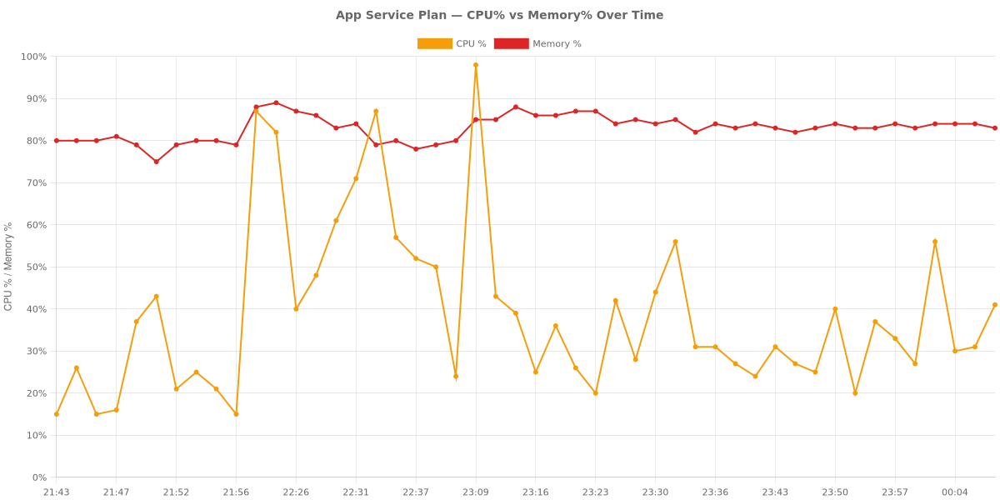
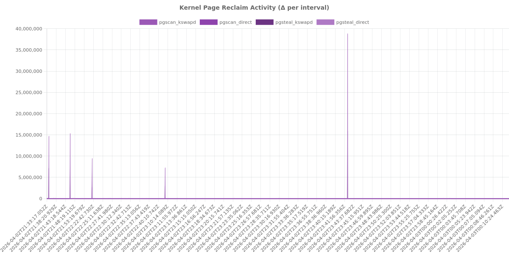
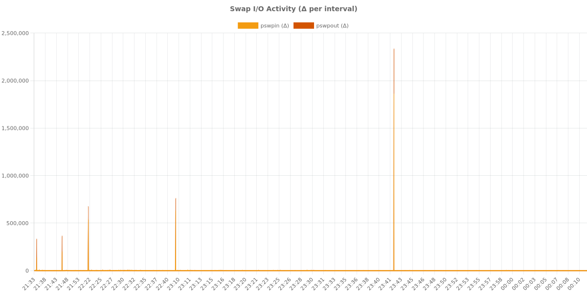
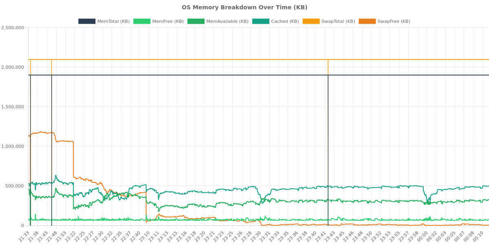
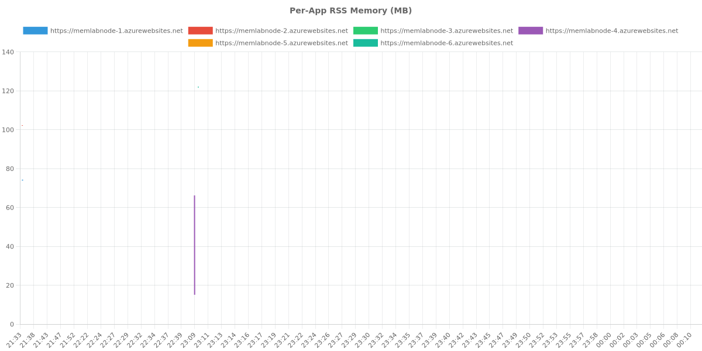
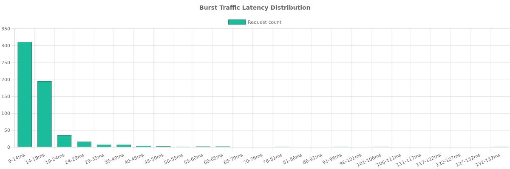
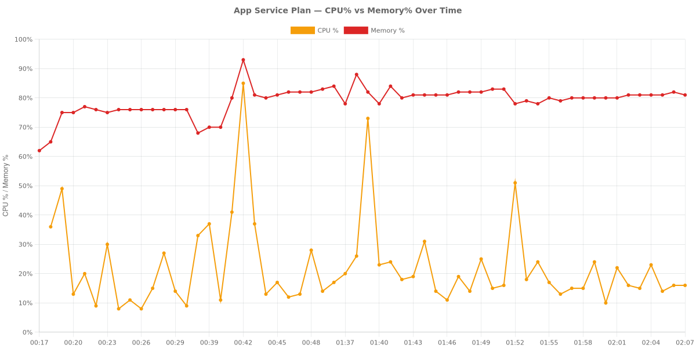
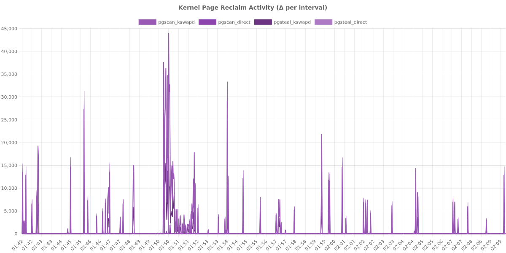
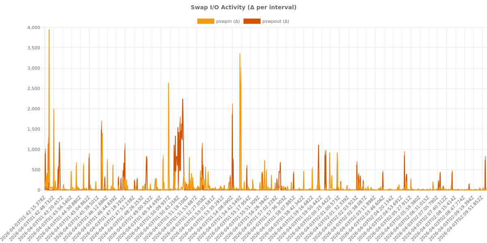
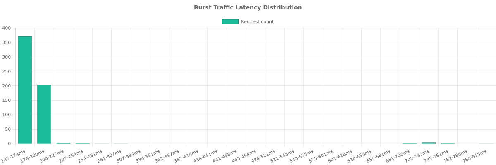

# Experiment Log: Node.js Memory Pressure on Azure App Service

This document provides a comprehensive scientific record of memory pressure experiments conducted on Azure App Service (Linux B1 SKU). The study investigates the relationship between high memory utilization, Linux kernel page reclaim activity, and unexpected CPU consumption.

## Experiment Overview

### Hypothesis
When an Azure B1 Linux App Service Plan hosts multiple Node.js applications that push aggregate memory utilization toward 90%, the Linux kernel's page reclaim mechanisms (kswapd, direct reclaim, and swap I/O) cause CPU usage to increase significantly, independent of application traffic levels.

### Environment Details
- **Experiment Period**: ~18 hours (overnight run)
- **Subscription ID**: ***REDACTED***
- **Resource Group**: rg-node-memory-lab
- **Region**: Korea Central
- **Plan SKU**: B1 (1 vCPU, 1.75 GB RAM, Linux)
- **Runtime**: Node.js 20 LTS
- **Host MemTotal**: ~1,855 MB
- **SwapTotal**: 2,048 MB (Confirmed via /proc/meminfo)

---

## ZIP Deploy Experiment

The first experiment used standard ZIP deployment for Node.js applications.

### Phase 0: Discovery
Deployed 2 Node.js applications (50MB RSS each). Verified that the `/diag/proc` endpoint successfully captures `/proc/meminfo` and `/proc/vmstat`. Confirmed the presence of Pressure Stall Information (PSI) at `/proc/pressure/memory`.

### Phase 1: Baseline
- **Duration**: ~25 minutes
- **Configuration**: 2 apps x 50MB
- **CPU**: 15-25% (Avg 20%)
- **Memory**: 79-80%
- **SwapFree**: ~1,063 MB
- **Cumulative pgscan_kswapd**: ~16.5M
- **Cumulative pgscan_direct**: 1,164
- **Avg Latency**: 56-70ms
- **Data Points**: 321 traffic rows, 641 diag rows, 106 azure-metrics rows

### Phase 2a: Approach
- **Duration**: ~20 minutes
- **Configuration**: 4 apps x 100MB
- **CPU**: 48-87% (Massive increase from baseline)
- **Memory**: 78-89%
- **SwapFree**: 417 MB (Down from 1,063 MB)
- **pgscan_kswapd**: 29.0M (+76% over baseline)
- **pgscan_direct**: 14,609 (+1155% over baseline)
- **pswpout**: 833,768 (+460% over baseline)
- **Latency**: 53-70ms (Stable despite CPU spike)

### Phase 2b: Core Test (Steady State)
- **Duration**: 60 minutes
- **Configuration**: 6 apps x 100MB
- **CPU Avg**: 35.2% (Steady range 20-56%, initial spike to 98% during scaling)
- **Memory Avg**: 84.3% (Stable between 82-88%)
- **SwapFree**: 12-17 MB (99.2% swap exhausted)
- **pgscan_kswapd Growth**: 14.5M to 40.4M (+179%)
- **pgscan_direct Growth**: 233 to 33,372 (+14,200%)
- **pgsteal_kswapd**: 8.1M to ~32M
- **pswpin Growth**: 121K to 1.94M (+1,500%)
- **pswpout Growth**: 321K to 2.41M (+650%)
- **allocstall**: Present (50 normal + 71 movable)
- **Memory Pressure (PSI)**: some avg300=5.79, full avg300=1.03
- **Observation**: CPU rose from a 20% baseline to 35% average (1.75x increase) with periodic spikes up to 87%, driven purely by kernel reclaim activity as request rates remained steady at 1 req/10s per app.

### Phase 3: Traffic Burst
- **Load**: 10 RPS for 60 seconds at high memory pressure.
- **Results**: 587 requests, 0 errors.
- **Latency**: Avg 16.8ms, p50 14ms, p95 30ms, p99 62ms.
- **CPU Impact**: Hit 56-71% during the burst. The system remained resilient under load.

### Visualizations (ZIP Deploy)

*Figure 1: CPU vs Memory correlation during ZIP deployment phases.*

*Figure 2: Escalation of pgscan_kswapd and pgscan_direct counters.*

*Figure 3: Intense pswpin/pswpout activity as swap nears exhaustion.*

*Figure 4: Breakdown of MemAvailable, Cached, and SwapFree.*

*Figure 5: Per-app memory footprint over time.*

*Figure 6: Burst traffic latency histogram.*

---

## Container Deploy Experiment

The second experiment evaluated the same scenarios using Docker containers.

### Phase 0-1: Baseline
- **Configuration**: 2 containers x 50MB
- **CPU**: 9-36% (Avg 20%)
- **Memory**: Settled at 76%
- **SwapFree**: 1,341 MB
- **Latency**: 59-117ms (Notably higher than ZIP)

### Phase 2a: Approach
- **Configuration**: 4 containers x 100MB
- **CPU**: 12-85% (Settled to 12-28%)
- **Memory**: 80-93% (Settled to 82-84%)
- **SwapFree**: 1,076 MB

### Phase 2b: Core Test (Failed Attempt)
An attempt to run 6 containers at 100MB each caused complete plan destabilization. Apps 1-4 returned 503 errors, and new containers (5-6) triggered the OOM killer on existing ones. This indicates that container runtime overhead is significantly higher than ZIP deployment on the B1 SKU.

### Phase 2b: Core Test (Adjusted)
- **Duration**: 28 minutes
- **Configuration**: 4 containers x 75MB
- **CPU Avg**: 18.8% (Range 10-51%)
- **Memory Avg**: 80.7%
- **SwapFree**: ~1,050 MB (49% swap used)
- **pgscan_kswapd Growth**: 14.2M to 15.3M (+1.1M)
- **pgscan_direct Growth**: 26,163 to 28,792 (+2,629)
- **pswpin Growth**: 203,756 to 259,687 (+55,931)
- **pswpout Growth**: 391,304 to 450,206 (+58,902)
- **Memory Pressure (PSI)**: some avg300=1.57, full avg300=0.51
- **Observation**: Container isolation resulted in lower swap utilization (49% vs 99.2%) and less intense reclaim activity compared to the ZIP experiment at similar memory percentages.

### Phase 3: Traffic Burst
- **Load**: 10 RPS for 60 seconds.
- **Results**: 590 requests, 0 errors.
- **Latency**: Avg 173.9ms, p50 159ms, p95 185ms, p99 715ms.
- **Observation**: Container latency under pressure was 10x higher than ZIP deployment.

### Visualizations (Container Deploy)

*Figure 7: CPU and Memory trends for containerized applications.*

*Figure 8: Reclaim activity in the container environment.*

*Figure 9: Swap activity during container experiments.*

*Figure 10: High latency variance observed during container traffic bursts.*

---

## Comparison: ZIP vs. Container

| Metric | ZIP Deploy (6x100MB) | Container Deploy (4x75MB) |
| :--- | :--- | :--- |
| **Max Capacity (B1)** | 6 apps @ 100MB | 4 apps @ 75MB (6 apps failed) |
| **Steady State CPU** | 35.2% average | 18.8% average |
| **Memory Avg** | 84.3% | 80.7% |
| **Swap Utilization** | 99.2% (Nearly Full) | 49.0% |
| **pgscan_kswapd Delta** | +25.9M (in 60 min) | +1.1M (in 28 min) |
| **Burst Latency (Avg)** | 16.8 ms | 173.9 ms |
| **Burst Latency (p99)** | 62 ms | 715 ms |
| **PSI (Some/Full)** | 5.79 / 1.03 | 1.57 / 0.51 |

---

## Final Verdict and Recommendations

### Hypothesis Status: PARTIALLY SUPPORTED

The experiment confirms that memory pressure drives CPU increases via kernel reclaim activity, though the behavior differs by deployment type:

- **ZIP Deploy**: The hypothesis is strongly supported. CPU usage increased by 1.75x (from 20% to 35% avg) purely due to kernel activity. The near-total exhaustion of swap triggered massive increases in `pgscan_direct` (+14,200%) and `pswpin` (+1,500%), correlating directly with CPU spikes.
- **Container Deploy**: The primary risk is destabilization rather than gradual CPU creep. The container runtime introduces enough overhead that a B1 plan fails to reach the same level of sustained memory pressure before applications crash. However, request latency is significantly worse (10x) for containers under pressure compared to ZIP.

### Customer Recommendations

1. **Maintain Memory Buffer**: Keep `MemoryPercentage` below 80% on B1 Linux plans. Crossing this threshold triggers aggressive kernel reclaim and swap I/O, which steals CPU cycles from your application.
2. **Monitor Reclaim Counters**: If CPU spikes occur without a corresponding increase in traffic, check for `pgscan_kswapd` and `pgscan_direct` activity. These are leading indicators of memory-driven performance degradation.
3. **Container Limitations**: Avoid hosting more than 2-3 containers on a single B1 plan if they have non-trivial memory requirements. The startup overhead and runtime isolation lead to earlier OOM events and higher latency variance.
4. **Scaling Strategy**: If your application consistently operates above 80% memory, scale up to the B2 or B3 SKU. The additional RAM will reduce reliance on the 2GB swap partition and stabilize CPU performance.
5. **ZIP vs. Container**: For maximum density on small SKUs like B1, ZIP deployment is more efficient. Containers provide better isolation but consume significantly more resources, leading to plan-wide failures when over-provisioned.

---

## Data Summary

### ZIP Deploy
- **Result Directory**: `results/zip-deploy/`
- **Total Files**: 284 (~110 MB)
- **Traffic Rows**: 3,289
- **Diag Rows**: 6,561
- **Metrics Samples**: 1,204
- **Burst Samples**: 588

### Container Deploy
- **Result Directory**: `results/container-deploy/`
- **Total Files**: 100
- **Traffic Rows**: 684
- **Diag Rows**: 1,041
- **Metrics Samples**: 157
- **Burst Samples**: 591
